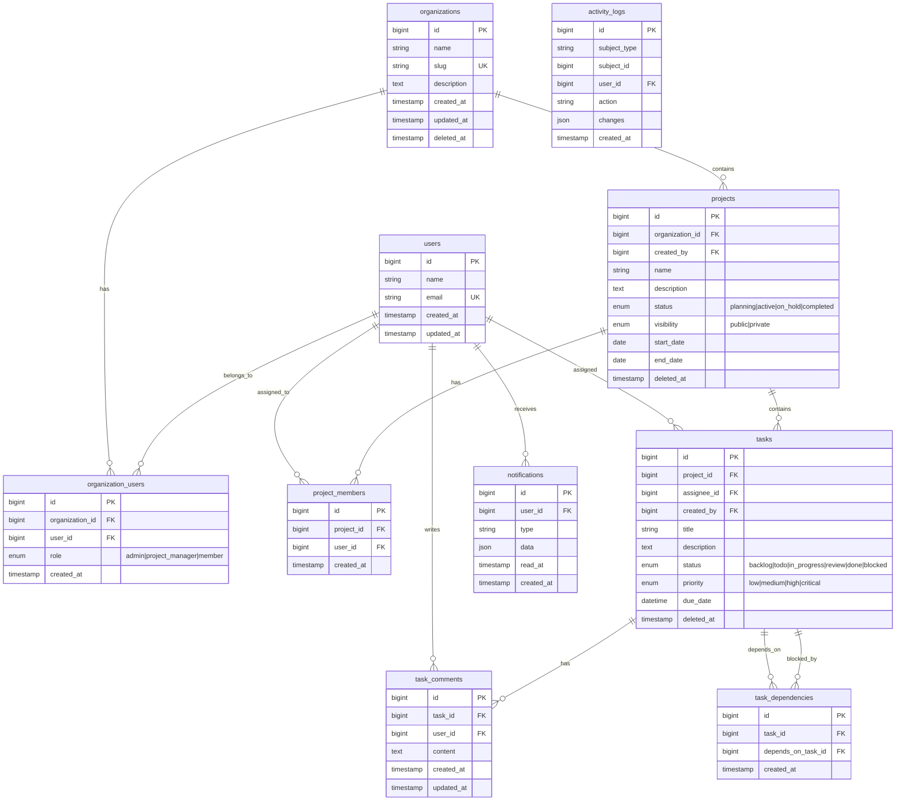

# Task Management Platform

A cloud-based Task Management & Collaboration Platform built with Laravel 12 (PHP 8.2+) and Vue 3 (TypeScript). Enables teams to manage projects, tasks, and real-time collaboration with robust access controls and notifications.

## Table of Contents

- [Project Overview](#project-overview)
- [Architecture](#architecture)
- [Tech Stack](#tech-stack)
- [Prerequisites](#prerequisites)
- [Installation](#installation)
- [Running the Application](#running-the-application)
- [Mock Authentication](#mock-authentication)
- [API Documentation](#api-documentation)
- [Database Schema](#database-schema)
- [Design Patterns & Principles](#design-patterns--principles)
- [Security](#security)
- [Testing](#testing)
- [AWS Deployment Guide](#aws-deployment-guide)
- [Future Improvements](#future-improvements)

---

## Project Overview

This platform provides:

- **Multi-organization support** - Isolated data per organization
- **Project management** - Create, update, archive projects with team assignments
- **Task management** - Kanban-style boards with priorities, statuses, and dependencies
- **Notifications** - In-app notification center with read/unread tracking
- **Role-based access control** - Member, Project Manager, and Organization Admin roles

---

## Architecture

### System Architecture Diagram


### Request Flow


### Backend Structure

```
backend/
├── app/
│   ├── Http/
│   │   ├── Controllers/Api/    # REST API endpoints
│   │   ├── Middleware/         # JWT authentication
│   │   ├── Requests/           # Form validation
│   │   └── Resources/          # JSON transformation
│   ├── Models/                 # Eloquent models
│   ├── Services/               # Business logic layer
│   ├── Repositories/           # Data access layer
│   │   └── Interfaces/         # Repository contracts
│   ├── Traits/                 # Shared functionality
│   └── Providers/              # Dependency injection
├── config/                     # App configuration
├── database/
│   ├── migrations/             # Schema definitions
│   └── seeders/                # Sample data
└── routes/api.php              # API route definitions
```

### Frontend Structure

```
frontend/src/
├── api/                        # Axios client & API modules
├── components/
│   ├── common/                 # Reusable components
│   └── layout/                 # App shell components
├── composables/                # Vue composition utilities
├── router/                     # Vue Router config
├── stores/                     # Pinia state management
├── types/                      # TypeScript interfaces
└── views/                      # Page components
```

---

## Tech Stack

### Backend
| Technology | Version | Purpose |
|------------|---------|---------|
| PHP | 8.2+ | Runtime |
| Laravel | 12.x | Framework |
| MySQL | 8.0+ | Database |
| Redis | 7.x | Cache, Sessions, Queues |
| JWT | - | Authentication |

### Frontend
| Technology | Version | Purpose |
|------------|---------|---------|
| Vue.js | 3.x | UI Framework |
| TypeScript | 5.x | Type Safety |
| Pinia | 2.x | State Management |
| Vue Router | 4.x | Routing |
| Vite | 6.x | Build Tool |
| Bootstrap | 5.x | CSS Framework |

### Infrastructure
| Technology | Version | Purpose |
|------------|---------|---------|
| Docker | 20.10+ | Containerization |
| Docker Compose | v2 | Multi-container orchestration |
| Nginx | Alpine | Web server (production) |

---

## Prerequisites

### For Docker Setup (Recommended)
- **Docker** 20.10+ and Docker Compose v2
- **Git**

### For Local Setup
- **PHP** 8.2 or higher
- **Composer** 2.x
- **Node.js** 18+ and npm
- **MySQL** 8.0+ or SQLite 3
- **Git**

---

## Installation

### 1. Clone the Repository

```bash
git clone <repository-url>
cd task-management-platform
```

### 2. Docker Setup (Recommended)

The easiest way to run the application is with Docker:

```bash
# Copy environment file
cp .env.example .env

# Start all services (MySQL, Redis, Backend, Frontend)
docker compose up -d

# First run only: seed the database
docker compose exec backend php artisan db:seed
```

**Services:**
| Service | URL | Description |
|---------|-----|-------------|
| Frontend | http://localhost:3000 | Vue.js application |
| Backend API | http://localhost:8000 | Laravel API |
| Swagger Docs | http://localhost:8000/api/documentation | API documentation |
| MySQL | localhost:3307 | Database (exposed for external tools) |

**Docker Commands:**
```bash
docker compose up -d            # Start all services
docker compose down             # Stop all services
docker compose logs -f          # View logs (all services)
docker compose logs backend     # View backend logs
docker compose exec backend sh  # Shell into backend container
docker compose up -d --build    # Rebuild and restart
```

**Environment Variables (.env):**
| Variable | Default | Description |
|----------|---------|-------------|
| `FRONTEND_PORT` | 3000 | Frontend port |
| `BACKEND_PORT` | 8000 | Backend API port |
| `DB_PORT` | 3307 | MySQL exposed port |
| `AUTO_MIGRATE` | true | Run migrations on startup |
| `AUTO_SEED` | false | Run seeders on startup |

> **Note:** Set `AUTO_SEED=true` only for the first deployment, then set it back to `false` to avoid duplicate entry errors on container restart.

---

### 3. Local Setup (Without Docker)

#### Backend Setup

```bash
cd backend

# Install PHP dependencies
composer install

# Copy environment file
cp .env.example .env

# Generate application key
php artisan key:generate

# Configure database in .env (MySQL example):
# DB_CONNECTION=mysql
# DB_HOST=127.0.0.1
# DB_PORT=3306
# DB_DATABASE=task_management
# DB_USERNAME=root
# DB_PASSWORD=your_password

# Or use SQLite (simpler for development):
# DB_CONNECTION=sqlite
# DB_DATABASE=/absolute/path/to/database.sqlite

# Run migrations
php artisan migrate

# Seed the database with sample data
php artisan db:seed
```

### 3. Frontend Setup

```bash
cd frontend

# Install dependencies
npm install
```

---

## Running the Application

### Option 1: Full Stack (Recommended)

```bash
cd backend
composer dev
```

This starts concurrently:
- Laravel backend on `http://localhost:8000`
- Queue worker for background jobs
- Laravel Pail for log streaming
- Vue frontend on `http://localhost:5173`

### Option 2: Separate Terminals

**Terminal 1 - Backend:**
```bash
cd backend
php artisan serve
```

**Terminal 2 - Frontend:**
```bash
cd frontend
npm run dev
```

### Access the Application

- **Frontend:** http://localhost:5173
- **Backend API:** http://localhost:8000/api

---

## Mock Authentication

This project uses a **mocked authentication flow** for demonstration purposes. No real user registration or password hashing is implemented.

### Available Endpoints

| Method | Endpoint | Description |
|--------|----------|-------------|
| `GET` | `/api/auth/mock-users` | List all available mock users |
| `POST` | `/api/auth/login` | Login with email/password |
| `GET` | `/api/auth/me` | Get current authenticated user |
| `POST` | `/api/auth/logout` | Logout (client-side token disposal) |

### Mock Users

All users have password: `password123`

| Email | Role | Organization | Permissions |
|-------|------|--------------|-------------|
| `admin@example.com` | Organization Admin | Org 1 | Full access to org settings, users, all projects |
| `manager@example.com` | Project Manager | Org 1 | Create projects, assign tasks, manage team |
| `member@example.com` | Member | Org 1 | View/work on assigned tasks only |
| `member2@example.com` | Member | Org 1 | View/work on assigned tasks only |
| `admin2@example.com` | Organization Admin | Org 2 | Full access (different organization) |

### Token Format

The API returns a signed **JWT token** containing:

```json
{
  "sub": 1,
  "email": "admin@example.com",
  "role": "admin",
  "orgId": 1,
  "iat": 1700000000,
  "exp": 1700003600
}
```

- **sub**: User ID
- **role**: User role (admin, project_manager, member)
- **orgId**: Organization ID (used to scope all queries)
- **exp**: Token expiration (configurable via `JWT_TTL` in .env, default 60 minutes)

### Switching Users/Roles

1. **Via UI:** On the login page, select a user from the dropdown
2. **Via API:** Call `POST /api/auth/login` with different credentials:

```bash
curl -X POST http://localhost:8000/api/auth/login \
  -H "Content-Type: application/json" \
  -d '{"email": "manager@example.com", "password": "password123"}'
```

### Organization Scoping

All data is automatically scoped by `orgId` from the JWT token:
- Users can only see projects within their organization
- Tasks are scoped through their parent project
- Notifications are user-specific

---

## API Documentation

### Swagger UI (Interactive Documentation)

This project includes interactive API documentation powered by **Swagger/OpenAPI**:

- **Swagger UI:** http://localhost:8000/api/documentation

Features:
- Browse all available endpoints
- View request/response schemas
- Test API calls directly from the browser
- JWT Bearer token authentication support

The API specification is maintained in a separate YAML file for clean controller code:
```
backend/storage/api-docs/api-docs.yaml
```

### Base URL

```
http://localhost:8000/api
```

### Authentication

Include the JWT token in the Authorization header:
```
Authorization: Bearer <token>
```

### Response Format

**Success Response:**
```json
{
  "success": true,
  "data": { ... },
  "message": "Operation successful",
  "meta": {
    "page": 1,
    "per_page": 20,
    "total": 100,
    "total_pages": 5
  }
}
```

**Error Response:**
```json
{
  "success": false,
  "error": {
    "code": "VALIDATION_ERROR",
    "message": "Validation failed",
    "details": {
      "email": ["The email field is required."]
    }
  }
}
```

### Endpoints Overview

#### Authentication
| Method | Endpoint | Description |
|--------|----------|-------------|
| `GET` | `/auth/mock-users` | List mock users |
| `POST` | `/auth/login` | Login |
| `GET` | `/auth/me` | Current user |
| `POST` | `/auth/logout` | Logout |

#### Projects
| Method | Endpoint | Description |
|--------|----------|-------------|
| `GET` | `/projects` | List projects (paginated) |
| `POST` | `/projects` | Create project |
| `GET` | `/projects/{id}` | Get project |
| `PUT` | `/projects/{id}` | Update project |
| `DELETE` | `/projects/{id}` | Archive project (soft delete) |
| `POST` | `/projects/{id}/restore` | Restore archived project |
| `GET` | `/projects/{id}/members` | List project members |
| `POST` | `/projects/{id}/members` | Add member |
| `DELETE` | `/projects/{id}/members/{memberId}` | Remove member |

**Project Filters:** `?status=active&visibility=public&search=keyword&include_archived=true&sort_by=created_at&sort_direction=desc`

#### Tasks
| Method | Endpoint | Description |
|--------|----------|-------------|
| `GET` | `/projects/{id}/tasks` | List tasks |
| `POST` | `/projects/{id}/tasks` | Create task |
| `GET` | `/projects/{id}/tasks/{taskId}` | Get task |
| `PUT` | `/projects/{id}/tasks/{taskId}` | Update task |
| `DELETE` | `/projects/{id}/tasks/{taskId}` | Delete task |
| `POST` | `/projects/{id}/tasks/{taskId}/restore` | Restore task |
| `GET` | `/my-tasks` | Get current user's tasks |

**Task Filters:** `?status=in_progress&priority=high&assignee_id=1&search=keyword&due_date_from=2024-01-01&due_date_to=2024-12-31`

#### Task Dependencies & Comments
| Method | Endpoint | Description |
|--------|----------|-------------|
| `GET` | `/projects/{id}/tasks/{taskId}/dependencies` | List dependencies |
| `POST` | `/projects/{id}/tasks/{taskId}/dependencies` | Add dependency |
| `DELETE` | `/projects/{id}/tasks/{taskId}/dependencies/{depId}` | Remove dependency |
| `GET` | `/projects/{id}/tasks/{taskId}/comments` | List comments |
| `POST` | `/projects/{id}/tasks/{taskId}/comments` | Add comment |
| `PUT` | `/projects/{id}/tasks/{taskId}/comments/{commentId}` | Update comment |
| `DELETE` | `/projects/{id}/tasks/{taskId}/comments/{commentId}` | Delete comment |

#### Notifications
| Method | Endpoint | Description |
|--------|----------|-------------|
| `GET` | `/notifications` | List notifications |
| `GET` | `/notifications/unread-count` | Get unread count |
| `POST` | `/notifications/mark-all-read` | Mark all as read |
| `DELETE` | `/notifications/read` | Delete all read |
| `GET` | `/notifications/{id}` | Get notification |
| `POST` | `/notifications/{id}/read` | Mark as read |
| `POST` | `/notifications/{id}/unread` | Mark as unread |
| `DELETE` | `/notifications/{id}` | Delete notification |

---

## Database Schema

### Entity Relationship Diagram



### Core Tables

| Table | Description |
|-------|-------------|
| `organizations` | Multi-tenant organization data |
| `users` | User accounts (synced from mock auth) |
| `organization_users` | User-org membership with roles |
| `projects` | Project details, status, visibility |
| `project_members` | Project-user assignments |
| `tasks` | Task data with status, priority, assignee |
| `task_comments` | Discussion comments on tasks |
| `task_dependencies` | Task-to-task dependency relationships |
| `notifications` | User notifications |
| `activity_logs` | Audit trail for all actions |

### Key Indexes

Optimized indexes for common query patterns:

- `tasks.project_id` - Task listing by project
- `tasks.status` - Kanban board filtering
- `tasks.priority` - Priority-based sorting
- `tasks(project_id, status)` - Composite for board queries
- `tasks(status, priority)` - Composite for filtered lists
- `tasks(assignee_id, status)` - My Tasks queries

---

## Design Patterns & Principles

### Patterns Used

| Pattern | Implementation |
|---------|----------------|
| **Repository Pattern** | `app/Repositories/` - Abstracts data access behind interfaces |
| **Service Layer** | `app/Services/` - Business logic separated from controllers |
| **Dependency Injection** | Via Laravel's service container and `RepositoryServiceProvider` |
| **DTO/Resource Pattern** | `app/Http/Resources/` - Transforms models for API responses |
| **Form Request Validation** | `app/Http/Requests/` - Validates and authorizes requests |

### SOLID Principles

- **Single Responsibility**: Controllers handle HTTP, Services handle logic, Repositories handle data
- **Open/Closed**: Repository interfaces allow swapping implementations
- **Liskov Substitution**: All repositories implement common interface
- **Interface Segregation**: Specific interfaces per repository
- **Dependency Inversion**: Controllers depend on service abstractions

### Frontend Architecture

- **Composition API** - Modern Vue 3 patterns
- **Pinia Stores** - Centralized state management
- **TypeScript** - Full type safety across the application
- **API Layer Abstraction** - Axios client with interceptors

---

## Security

### Security Architecture


### Authentication Flow


### Implemented Measures

| Measure | Implementation | Layer |
|---------|----------------|-------|
| **JWT Authentication** | HS256 signed tokens with configurable TTL | Authentication |
| **CORS Configuration** | Whitelist frontend origin only | Network |
| **Input Validation** | Laravel Form Request classes | Application |
| **SQL Injection Prevention** | Eloquent ORM parameterized queries | Database |
| **XSS Prevention** | Automatic output escaping | Response |
| **CSRF Protection** | SPA uses JWT (stateless) | Application |
| **Soft Deletes** | Data preservation, audit trail | Database |
| **Role-Based Access** | 3-tier: Admin > PM > Member | Authorization |
| **Multi-Tenancy** | Organization scoping via JWT orgId | Data Isolation |

### Authorization Matrix

| Action | Member | Project Manager | Admin |
|--------|--------|-----------------|-------|
| View assigned tasks | ✅ | ✅ | ✅ |
| Update own tasks | ✅ | ✅ | ✅ |
| View project (public) | ✅ | ✅ | ✅ |
| View project (private) | Members only | ✅ | ✅ |
| Create tasks | ❌ | ✅ | ✅ |
| Assign tasks | ❌ | ✅ | ✅ |
| Manage project members | ❌ | ✅ | ✅ |
| Create projects | ❌ | ✅ | ✅ |
| Archive projects | ❌ | ✅ | ✅ |
| Organization settings | ❌ | ❌ | ✅ |

### Token Storage

Frontend stores JWT in localStorage with automatic:
- Token injection via Axios interceptor
- 401 response handling (auto-logout)
- Token expiration check before requests

### Security Best Practices Applied

1. **No sensitive data in JWT** - Only user ID, email, role, and org ID
2. **Short token lifetime** - Configurable TTL (default 60 minutes)
3. **Parameterized queries** - All database operations via Eloquent ORM
4. **Input sanitization** - Laravel Form Requests validate all input
5. **Output encoding** - Blade/JSON responses auto-escaped
6. **Audit logging** - Activity logs track sensitive operations
7. **Soft deletes** - No permanent data loss, maintains history

---

## Testing

The project includes comprehensive tests using PHPUnit with Laravel's testing utilities, covering both unit tests for business logic and integration tests for API endpoints.

### Test Coverage

#### Unit Tests (Services & Models)
| Test Suite | Tests | Description |
|------------|-------|-------------|
| JwtServiceTest | 11 | Token encoding, decoding, validation, expiration |
| AuthServiceTest | 14 | Login, token validation, user sync, role handling |
| ProjectServiceTest | 21 | Access control, member management, CRUD logic |
| TaskServiceTest | 29 | Task operations, dependencies, comments, permissions |
| NotificationServiceTest | 20 | Notification CRUD, helper methods |
| OrganizationTest | 8 | Organization relationships, role-based user queries |
| OrganizationUserTest | 9 | Role checks (isAdmin, isManager, isMember) |
| ProjectMemberTest | 3 | Project-user relationship |
| TaskDependencyTest | 3 | Task dependency relationships |
| **Unit Total** | **117** | |

#### Integration Tests (API Endpoints)
| Test Suite | Tests | Description |
|------------|-------|-------------|
| AuthControllerTest | 17 | Authentication endpoints |
| NotificationControllerTest | 17 | Notification endpoints |
| ProjectControllerTest | 28 | Project CRUD + members |
| TaskControllerTest | 30 | Task CRUD + dependencies + comments |
| **Integration Total** | **92** | |

| **Grand Total** | **209 tests** | **516 assertions** |

### Test Categories

**Unit Tests (Business Logic & Models):**
- JWT token creation, validation, and expiration
- Authentication flow with mock users and database users
- Project access control (admin, manager, member roles)
- Task dependency management with circular dependency detection
- Comment ownership validation
- Notification helper methods
- Model relationships and role-checking methods

**Integration Tests (API Endpoints):**
- Authentication: Login, logout, token validation
- Projects: CRUD, filtering, member management, soft delete/restore
- Tasks: CRUD, filtering, dependencies, comments
- Notifications: List, mark read/unread, delete

### Running Tests

```bash
cd backend

# Run all tests
php artisan test

# Run API tests only
php artisan test --filter=Api

# Run specific test class
php artisan test --filter=TaskControllerTest

# Run with verbose output
php artisan test --filter=Api -v
```

### Code Coverage Report

**Target: 80%+ code coverage** ✓ **Achieved: 87.1%**

| Category | Coverage |
|----------|----------|
| Services | 92-100% |
| Controllers | 89-98% |
| Models | 71-100% |
| Repositories | 69-75% |
| Resources | 100% |
| **Total** | **87.1%** |

To generate coverage reports, you need PCOV or Xdebug installed:

```bash
# Install PCOV (Ubuntu/Debian) - faster than Xdebug
sudo apt-get install php-pcov

# Or install via PECL
pecl install pcov
echo "extension=pcov.so" | sudo tee /etc/php/8.2/cli/conf.d/20-pcov.ini
```

Once installed, run coverage:

```bash
cd backend

# Terminal coverage summary
composer test:coverage

# Generate HTML coverage report
composer test:coverage-html

# View report in browser (opens coverage-report/index.html)
```

The HTML report provides:
- Line-by-line coverage highlighting
- Method and class coverage percentages
- Uncovered code identification

Coverage configuration is in `phpunit.xml`:
- Source: `app/` directory
- Excludes: Console, Exceptions, Providers (framework boilerplate)
- Reports: HTML, text summary, and Clover XML

---

## AWS Deployment Guide

This guide outlines deploying the Task Management Platform to AWS infrastructure.

### Architecture Overview

```
                    ┌─────────────────┐
                    │   Route 53      │
                    │   (DNS)         │
                    └────────┬────────┘
                             │
                    ┌────────▼────────┐
                    │   CloudFront    │
                    │   (CDN)         │
                    └────────┬────────┘
                             │
         ┌───────────────────┼───────────────────┐
         │                   │                   │
┌────────▼────────┐ ┌────────▼────────┐ ┌───────▼───────┐
│     S3          │ │ Application     │ │    RDS        │
│ (Vue Frontend)  │ │ Load Balancer   │ │   (MySQL)     │
└─────────────────┘ └────────┬────────┘ └───────────────┘
                             │
                    ┌────────▼────────┐
                    │   ECS Fargate   │
                    │ (Laravel API)   │
                    └─────────────────┘
```

### Prerequisites

- AWS Account with appropriate permissions
- AWS CLI configured
- Docker installed locally
- Domain name (optional, for custom domain)

### Step 1: Database Setup (RDS)

1. **Create RDS MySQL Instance:**
```bash
aws rds create-db-instance \
  --db-instance-identifier task-management-db \
  --db-instance-class db.t3.micro \
  --engine mysql \
  --engine-version 8.0 \
  --master-username admin \
  --master-user-password <your-password> \
  --allocated-storage 20 \
  --vpc-security-group-ids <sg-id> \
  --db-name task_management \
  --backup-retention-period 7 \
  --multi-az false
```

2. **Configure Security Group** to allow inbound MySQL (port 3306) from your ECS tasks.

### Step 2: Backend Deployment (ECS Fargate)

1. **Create ECR Repository:**
```bash
aws ecr create-repository --repository-name task-management-api
```

2. **Build and Push Docker Image:**
```bash
# From backend directory
docker build -t task-management-api .

# Tag and push
aws ecr get-login-password --region <region> | docker login --username AWS --password-stdin <account-id>.dkr.ecr.<region>.amazonaws.com
docker tag task-management-api:latest <account-id>.dkr.ecr.<region>.amazonaws.com/task-management-api:latest
docker push <account-id>.dkr.ecr.<region>.amazonaws.com/task-management-api:latest
```

3. **Create ECS Cluster and Service:**
```bash
# Create cluster
aws ecs create-cluster --cluster-name task-management-cluster

# Create task definition (see task-definition.json below)
aws ecs register-task-definition --cli-input-json file://task-definition.json

# Create service with ALB
aws ecs create-service \
  --cluster task-management-cluster \
  --service-name task-management-api \
  --task-definition task-management-api \
  --desired-count 2 \
  --launch-type FARGATE \
  --network-configuration "awsvpcConfiguration={subnets=[<subnet-ids>],securityGroups=[<sg-id>],assignPublicIp=ENABLED}"
```

4. **Sample task-definition.json:**
```json
{
  "family": "task-management-api",
  "networkMode": "awsvpc",
  "requiresCompatibilities": ["FARGATE"],
  "cpu": "256",
  "memory": "512",
  "containerDefinitions": [{
    "name": "api",
    "image": "<account-id>.dkr.ecr.<region>.amazonaws.com/task-management-api:latest",
    "portMappings": [{"containerPort": 80}],
    "environment": [
      {"name": "APP_ENV", "value": "production"},
      {"name": "DB_CONNECTION", "value": "mysql"},
      {"name": "DB_HOST", "value": "<rds-endpoint>"},
      {"name": "DB_DATABASE", "value": "task_management"},
      {"name": "DB_USERNAME", "value": "admin"}
    ],
    "secrets": [
      {"name": "APP_KEY", "valueFrom": "<secrets-manager-arn>:APP_KEY::"},
      {"name": "DB_PASSWORD", "valueFrom": "<secrets-manager-arn>:DB_PASSWORD::"},
      {"name": "JWT_SECRET", "valueFrom": "<secrets-manager-arn>:JWT_SECRET::"}
    ],
    "logConfiguration": {
      "logDriver": "awslogs",
      "options": {
        "awslogs-group": "/ecs/task-management-api",
        "awslogs-region": "<region>",
        "awslogs-stream-prefix": "ecs"
      }
    }
  }]
}
```

### Step 3: Frontend Deployment (S3 + CloudFront)

1. **Build Frontend:**
```bash
cd frontend
npm run build
```

2. **Create S3 Bucket:**
```bash
aws s3 mb s3://task-management-frontend-<unique-id>
aws s3 website s3://task-management-frontend-<unique-id> --index-document index.html --error-document index.html
```

3. **Upload Build:**
```bash
aws s3 sync dist/ s3://task-management-frontend-<unique-id> --delete
```

4. **Create CloudFront Distribution:**
```bash
aws cloudfront create-distribution \
  --origin-domain-name task-management-frontend-<unique-id>.s3.amazonaws.com \
  --default-root-object index.html
```

### Step 4: Environment Configuration

**Backend Environment Variables (AWS Secrets Manager):**
```
APP_KEY=base64:...
APP_ENV=production
APP_DEBUG=false
APP_URL=https://api.yourdomain.com

DB_CONNECTION=mysql
DB_HOST=<rds-endpoint>
DB_PORT=3306
DB_DATABASE=task_management
DB_USERNAME=admin
DB_PASSWORD=<secure-password>

JWT_SECRET=<random-string>
JWT_TTL=60
```

**Frontend Environment (.env.production):**
```
VITE_API_URL=https://api.yourdomain.com/api
```

### Step 5: Run Migrations

```bash
# Connect to ECS task and run migrations
aws ecs execute-command \
  --cluster task-management-cluster \
  --task <task-id> \
  --container api \
  --interactive \
  --command "/bin/sh -c 'php artisan migrate --force'"
```

### Cost Estimation (Monthly)

| Service | Configuration | Estimated Cost |
|---------|---------------|----------------|
| RDS MySQL | db.t3.micro | ~$15 |
| ECS Fargate | 2 tasks (256 CPU, 512 MB) | ~$20 |
| S3 | Static hosting | ~$1 |
| CloudFront | 100GB transfer | ~$10 |
| ALB | 1 load balancer | ~$16 |
| **Total** | | **~$62/month** |

### Alternative: Simplified Deployment (EC2)

For cost-sensitive deployments, use a single EC2 instance:

```bash
# Launch t3.small with Amazon Linux 2
# Install: PHP 8.2, Nginx, MySQL client, Node.js
# Clone repo, configure .env, run migrations
# Use systemd for process management
# Estimated cost: ~$15/month
```

---

## Future Improvements

Given more time, the following enhancements would be prioritized:

### High Priority
1. **WebSocket Integration** - Real-time notifications via Laravel Echo

### Medium Priority
2. **Activity Feed** - Expose activity logs via API

### Nice to Have
3. **@mentions** - Parse and notify mentioned users in comments
4. **File Attachments** - S3 integration for task attachments
5. **Email Notifications** - Queue-based email delivery
6. **Skeleton Loaders** - Better loading UX in frontend

---

## Commands Reference

### Backend

```bash
composer setup          # Full setup (install, key, migrate, seed)
composer dev            # Start all services concurrently
composer test           # Run PHPUnit tests
./vendor/bin/pint       # Format code (PSR-12)
php artisan migrate:fresh --seed  # Reset database
```

### Frontend

```bash
npm run dev             # Development server
npm run build           # Production build
npm run preview         # Preview production build
npm run type-check      # TypeScript validation
```

---

## License

This project was created as a technical challenge submission.
